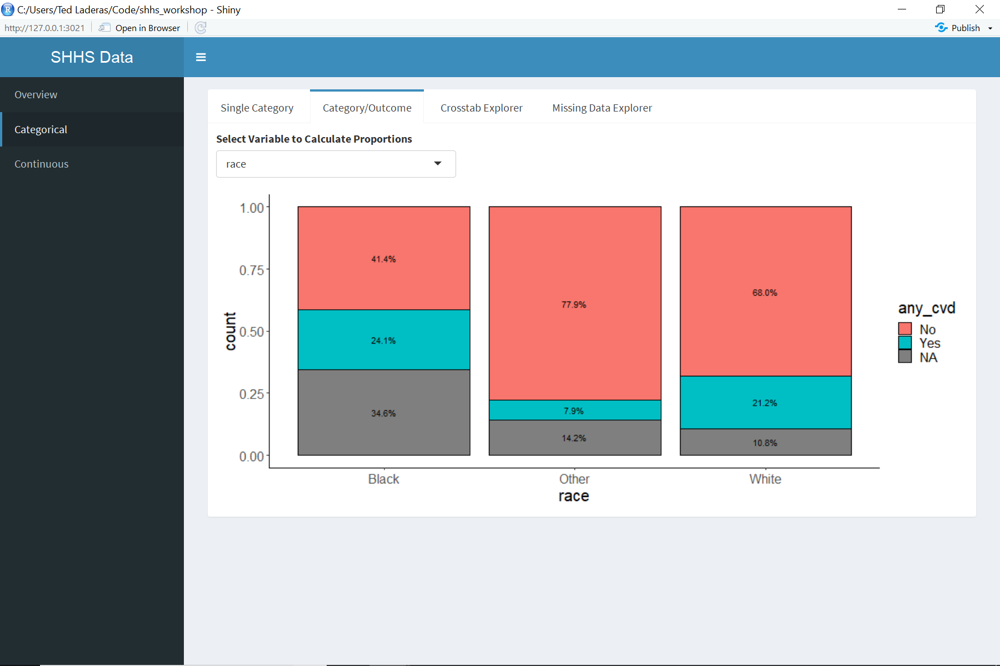

The following is the site for the materials for the clinical data wrangling workshop that was held from September 21 to September 26, 2018. This was a 12 hour workshop (spread over 4 days) where students got to work with a real research dataset (the [Sleep Heart Health Study](http://sleepdata.org) data). This is a workshop that we developed as part of an National Library of Medicine T15 training supplement in Data Science. The following is a short report describing the workshop and its outcomes.

## Intended Audience

We designed the workshop for our incoming informatics students (clinical and biology majors) in order to introduce them to the difficulties of working with clinical data. We anticipate that with a little adaptation, it should be accessible to audiences such as medical students, and other clinicians wanting to understand the nature of clinical data. 

## Learning Objectives

1. Understand the biology of sleep and sleep apnea and how the biology informs the covariates measured in the Sleep Heart Health Study
2. Understand why clinical data is useful and also why it's difficult to work with
3. Learn Exploratory Data Analysis techniques and use them to inform model building.
4. Learn to assess logistic regression models using simple diagnostics.

## The Dataset

We used the [Sleep Heart Health Study](https://sleepdata.org/datasets/shhs) dataset from the [National Sleep Research Resource](https://sleepdata.org). This is a dataset of approximately 5800 patients that have over 3000 covariates. We limited our students to a smaller number of covariates (17), including our outcome of interest, cardiovascular disease.

## Requirements

1. Students must have R/Rstudio installed (See [installation instructions](install/installing_R_Rstudio.pdf))
2. Students must fill out a [Data Access and Use Agreement for NSRR](RequestingDataAccessInstructions.pdf)
3. Students must have training covering basics of PHI and HIPAA (required by NSRR for their Data Access and Use Agreement)
4. Students should [clone or download the repo](http://github.com/laderast/shhs_workshop)

## Workshop Format

We designed the workshop to be a mix of didactic lectures and active learning exercises. Where possible, we had students work in groups to answer questions about the data. These activities included a data scavenger hunt using our EDA exploration app, and a logistic modeling exercise.

### Day 1 Outline

<table class="tg">
  <tr>
    <th class="tg-fymr">Session</th>
    <th class="tg-fymr">Lecture/Activity</th>
    <th class="tg-fymr">Format</th>
    <th class="tg-fymr">Duration</th>
  </tr>
  <tr>
    <td class="tg-0pky">0</td>
    <td class="tg-0pky">Introduction, Logistics, groups assigned</td>
    <td class="tg-0pky">NA</td>
    <td class="tg-0pky">30 min</td>
  </tr>
  <tr>
    <td class="tg-0pky">1a </td>
    <td class="tg-0pky">Biology of Sleep and Cardiovascular Disease</td>
    <td class="tg-0pky">Lecture</td>
    <td class="tg-0pky">40 min</td>
  </tr>
  <tr>
    <td class="tg-0pky">Break</td>
    <td class="tg-0pky">Breaktime</td>
    <td class="tg-0pky">NA</td>
    <td class="tg-0pky">15 min</td>
  </tr>
  <tr>
    <td class="tg-0lax">1b</td>
    <td class="tg-0lax">The Value of Clinical Data</td>
    <td class="tg-0lax">Lecture</td>
    <td class="tg-0lax">15 min</td>
  </tr>
  <tr>
    <td class="tg-0lax">2a</td>
    <td class="tg-0lax">Clinical Data Quality Issues</td>
    <td class="tg-0lax">Lecture</td>
    <td class="tg-0lax">40 min</td>
  </tr>
  <tr>
    <td class="tg-0lax">Break</td>
    <td class="tg-0lax">Lunch Break (with optional R install session)</td>
    <td class="tg-0lax">NA</td>
    <td class="tg-0lax">90 min</td>
  </tr>
  <tr>
    <td class="tg-0lax">2b</td>
    <td class="tg-0lax"><a href="slides/data_exploration_wrangling.html">Exploring the Sleep Heart Health Study Dataset</a></td>
    <td class="tg-0lax">Data Scavenger Hunt</td>
    <td class="tg-0lax">60 min</td>
  </tr>
  <tr>
    <td class="tg-0lax">3a</td>
    <td class="tg-0lax">Applying the Clinical Wrangling Process:  Diabetes</td>
    <td class="tg-0lax">Lecture</td>
    <td class="tg-0lax">45 min</td>
  </tr>
  <tr>
    <td class="tg-0lax">3b</td>
    <td class="tg-0lax"><a href="notebooks/predictive_model.nb.html">Logistic Regression Model Basics</a></td>
    <td class="tg-0lax">R Notebook</td>
    <td class="tg-0lax">60 min</td>
  </tr>
</table>

### Day 2

<table class="tg">
  <tr>
    <th class="tg-kiyi">Session</th>
    <th class="tg-kiyi">Lecture/Activity</th>
    <th class="tg-kiyi">Format</th>
    <th class="tg-kiyi">Duration</th>
  </tr>
  <tr>
    <td class="tg-xldj">4a</td>
    <td class="tg-xldj">Question/Answer session about Logistic Regression Notebook</td>
    <td class="tg-xldj">Q&amp;A</td>
    <td class="tg-xldj">50 min</td>
  </tr>
  <tr>
    <td class="tg-xldj">4b</td>
    <td class="tg-xldj">Assignment about race variable (assigned to groups)</td>
    <td class="tg-xldj">Homework</td>
    <td class="tg-xldj">10 min</td>
  </tr>
</table>

### Day 3

<table class="tg">
  <tr>
    <th class="tg-kiyi">Session</th>
    <th class="tg-kiyi">Lecture/Activity</th>
    <th class="tg-kiyi">Format</th>
    <th class="tg-kiyi">Duration</th>
  </tr>
  <tr>
    <td class="tg-xldj">5a</td>
    <td class="tg-xldj">Discussion about race as a covariate, sharing of findings</td>
    <td class="tg-xldj">Discussion</td>
    <td class="tg-xldj">30 min</td>
  </tr>
  <tr>
    <td class="tg-xldj">5b</td>
    <td class="tg-xldj">Overview of hypertension and how it relates to Sleep  Apnea/Cardiovascular Disease</td>
    <td class="tg-xldj">Lecture/Discussion</td>
    <td class="tg-xldj">30 min</td>
  </tr>
  <tr>
    <td class="tg-0lax">5c</td>
    <td class="tg-0lax"><a href="notebooks/final_report.nb.html">Work on Final Report</a></td>
    <td class="tg-0lax">In-class Lab time</td>
    <td class="tg-0lax">60 min</td>
  </tr>
</table>

### Day 4

<table class="tg">
  <tr>
    <th class="tg-kiyi">Session</th>
    <th class="tg-kiyi">Lecture/Activity</th>
    <th class="tg-kiyi">Format</th>
    <th class="tg-kiyi">Duration</th>
  </tr>
  <tr>
    <td class="tg-xldj">6a</td>
    <td class="tg-xldj">Group presentations about covariate decisions and resulting model</td>
    <td class="tg-xldj">R Notebook</td>
    <td class="tg-xldj">60 min</td>
  </tr>
  <tr>
    <td class="tg-0lax">6b</td>
    <td class="tg-0lax">Final Discussion and Wrap up</td>
    <td class="tg-0lax">Discussion</td>
    <td class="tg-0lax">30 min</td>
  </tr>
</table>

## Acknowledgements

We are grateful for the incoming informatics students’ enthusiasm and patience. Also thanks to the NLM T15 Supplement in Data Science, without which we would not have gotten the opportunity to conceptualize, put together, and deliver this workshop. Thanks again to Susan Redline and the [National Sleep Research Resource](http://sleepdata.org) group, especially Dan Mobley who helped us with the last-minute data use agreements.

## Licensing

This lesson material is shared under a Creative Commons Non-Commercial BY license. All code is shared under an Apache 2.0 License.