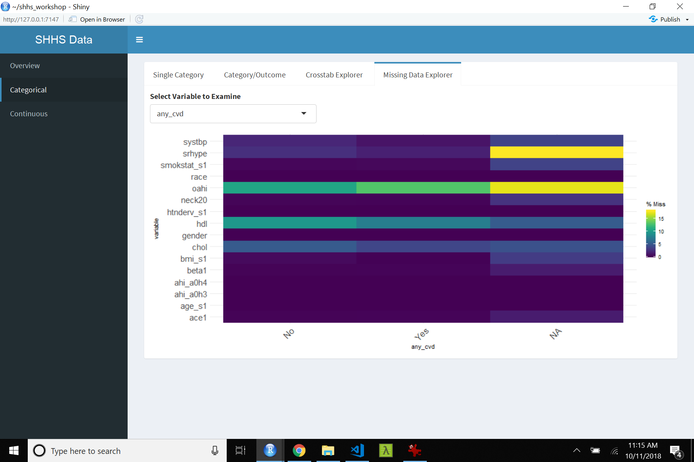

```{r setup, include=FALSE}
knitr::opts_chunk$set(echo = FALSE)
```

## Shiny App

Ask: We would like to deploy the Shiny Visualization App so we can show how the data exploration works for the workshop

## What is Shiny?

+ Interactive visualization application
+ hosted on http://shinyapps.io
+ Individual patient data is not exposed, just aggregate visualizations
+ Example (synthetic dataset): https://tladeras.shinyapps.io/cvdnight1/

## Covariates used in the app

+ Demographics:`age_s1`, `gender`, `smokstat_s1`, `bmi_s1`, `race`
+ Hypertension: `srhype`, `ace1`, `beta1`, `htnderv_s1`, `systbp`
+ Labs: `hdl`, `chol`
+ Cvd: `any_cvd`
+ Sleep: `ahi_a0h3`,`ahi_a0h4`, `oahi`, `neck20`.

## Visualization Example (visdat)


## Vis example 2 



## Vis example 3

