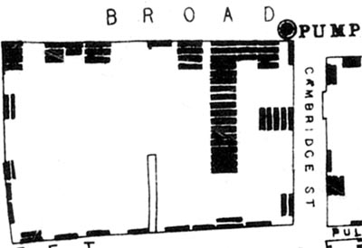

```{r setup, include=FALSE}
options(htmltools.dir.version = FALSE)
```

```{r xaringan-themer, include=FALSE}
library(xaringanthemer)
mono_dark(
  code_font_family = "Fira Code",
  code_font_url    = "https://cdn.rawgit.com/tonsky/FiraCode/1.204/distr/fira_code.css"
)
```

# Learning Objectives for This Session

1. *Understand* the purpose of exploratory data analysis (EDA)
2. *Learn* how to do EDA using `burro`
3. *Answer questions* about associations/correlations of variables with cardiovascular disease (CVD)

---

# Our Overall Goal  

- Predict cardiovascular disease in our patients
- Select appropriate variables in the data to include in our model
- Understand what our variables mean
- Understand interactions between variables
- Output: List of potential variables to add to our model 

---

# What is Exploratory Data Analysis?

- Pioneered by John Tukey
- Detective work on your data
- An *attitude* towards data, not just techniques
- 'Find patterns, reveal structure, and make tenative model assessments (Behrens)'

---

# Remember

"Exploratory data analysis can never be the whole story, but nothing else can serve as the foundation stone."
- John Tukey, *Exploratory Data Analysis*

---

# Why Data Exploration?  

- Need to be aware of issues in the data!


---

# Why Visualization?



---

# Let's look first

- Visualization is a gateway
- Understand the issues, not focus on coding right now
- Build your foundation, then start getting technical

---
# Burro

`burro` is a data explorer package we'll use to examine issues in our dataset. It opens up a dataset and lets us explore different aspects of it:

- Missing data
- Associations
- Correlations

If you're interested in it, you can see more about it here: http://laderast.github.io/burro

---

# Workflow for selecting variables

Ultimately, in our EDA, we want to make some decisions about which variables we think are useful in predicting cardiovascular disease:

1. **Missingness**: are there too many missing cases in our variable?
2. **Usefulness**: is there an association or correlation with our outcome?
3. **Association:** How associated is our variable with other variables in the model? Should we choose one or the other?
4. **Clinical/domain specific considerations**: We'll talk about this in the next session.

---
class: center, middle

# Notebook Time

## Double click `shhs_workshop.Rproj` in `shhs_workshop` directory
## Open up `session2-data_exploration.Rmd` in RStudio Project

---
# Congratulations

You are now a full fledged data explorer!


---

# Overall

- Data exploration is fun and detective work
- Be curious! Start with a question
- Assess the impact of adding your covariate to the model
    - Does the distribution look like other populations?
    - Is it associated with your outcome?
    - Is it associated with other variables?
    - Is the data missing in a suspicious way?

---
# Think about these questions about the data

- How is hypertension measured in the SHHS data?
- What is the relationship between Apnea Hypopnea Index (AHI) and cardiovascular disease?
- What does neck circumference have to do with sleep apnea?

