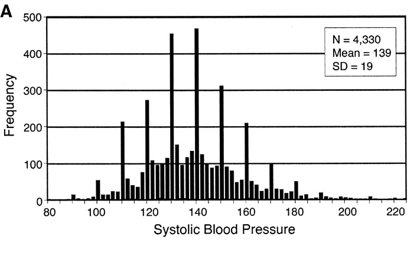

```{r setup, include=FALSE}
library(burro)
library(here)
knitr::opts_chunk$set(echo = FALSE)
data_dictionary <- read.csv(here("data/shhs-data-dictionary-0.13.1-variables.csv"))
shhs_data_sub <- data.table(read_rds(here("data/common_data_small.rds")))

```

## Our Overall Goal  

- Predict cardiovascular disease in our patients
- Select appropriate variables in the data to include in our model
- Understand what our variables mean
- Understand interactions between variables
- Output: List of potential variables to add to our model 

## What is Exploratory Data Analysis?

- Pioneered by John Tukey
- Detective work on your data
- An *attitude* towards data, not just techniques
- 'Find patterns, reveal structure, and make tenative model assessments (Behrens)'

## Remember

"Exploratory data analysis can never be the whole story, but nothing else can serve as the foundation stone."
- John Tukey, *Exploratory Data Analysis*

## Why Data Exploration?  

- Need to be aware of issues in the data!



## Why Visualization?


## Let's look first

- Visualization is a gateway
- Understand the issues, not focus on coding right now
- Build your foundation

## Running the Shiny App

In your workspace, you can use `runApp()` in the console to start, or open the `app.R` file and click the `Run App` play button in the top right of the script window.

```
runApp()
```

## Map your questions to a tab:


## What is the Overview Tab for?

- Seeing how many variables are in the dataset and which type
- Seeing missing values and complete cases
- Looking up a variable in the data dictionary

## Overview Tab

  - What values are missing from the dataset overall? (Visual Summary)
  - Are any numeric values skewed in distribution? (Tabular Summary)
  - How is the variable defined? (Data Dictionary)
  - What are the permissible values? (Data Dictionary)

## Overview Scavenger Hunt

1.  How many categorical variables are there?
1.  How many missing Cardiovascular Disease Cases are there?
1.  What is the mean age for the dataset?
1.  How is `oahi` calculated?

## What is the Category Tab for?

- Should we add a categorical variable to our model?
- Does my categorical variable have predictive value?
- Does adding my variable affect the number of cases I can analyse?
- Is my variable missing at random or not at random?
- Is my categorical variable confounded with another categorical variable?

## Categorical Tab

  - What percentages exist for my categorical variable? (Single Category)
  - Is my variable associated with outcome? (Category/Outcome)
  - Is my variable associated with other variables? (Crosstab)
  - Are the missing values of my variable evenly distributed? (Missing Data)
  
## Categorical Scavenger Hunt

1. How many categories are there for `race`?
1. Are the proportions of cvd cases balanced across `race`?
1. If you are `male`, are you more likely to have cardiovascular disease?
1. Is the proportion of missing data for `any_cvd` balanced across `race` categories? 

## Continuous Tab

- What is the distribution of my categorical variable? (Single Continuous)
- Is my continuous variable associated with outcome? (Continuous/Outcome)
- Is my continuous variable associated with another categorical variable? (Boxplot)
- Is my continous variable associated with another continous variable? (Correlation)
- Is my continuous variable missing values? (Correlation)

## Continuous Scavenger Hunt

1. As you get older, are you more likely to have CVD? 
1. Is `age_s1` evenly distributed across `race`? If not, how are they distributed?
1. Are `bmi_s1` and `neck20` correlated? Why do you think that's the case?
1. Should we include both `bmi_s1` and `neck20` in our dataset?

## Congratulations

You are now a full fledged data explorer!


## Overall

- Data exploration is fun and detective work
- Be curious! Start with a question
- Assess the impact of adding your covariate to the model
    - Does the distribution look like other populations?
    - Is it associated with your outcome?
    - Is it associated with other variables?
    - Is the data missing in a suspicious way?
