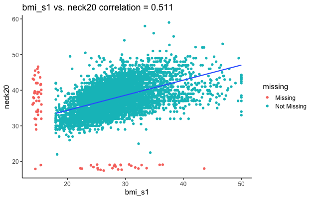

Welcome to your first R Notebook! This is a way to start executing R Code. We're going to step through an introductory exploration of our dataset. 

There are two main components to an R Notebook:

1) *Text blocks*, which don't contain code, they're text. You can use them to take notes about what you are doing, and explain code in the context of a presentation.
2) *Code blocks*, which contain code that you can run, or execute. 
The grey block below is a *code block*. Try pressing the green play button on the top right. What do you think is going to happen?

```{r}
3 + 10 
```

Note that code blocks are defined by using three ` (backticks) and the {r}. All the code is then followed with another three backticks:

```{r}
print("this is a code block")

```


# Starting Out

We're going to start looking at the Sleep Health Heart Study (SHHS) Data. To do so, we first need to:

1) load some software packages to help us explore the data (using the `library()` command), and 
2) load the data and data dictionary (using `readRDS()`, which reads in R's internal data format and `read.csv()`, which reads in a Comma-Separated-Value (`csv`) file.

Execute this code block.

```{r}
#here simplifies the folder structure
library(here)
library(burro)
library(dplyr)

#load the data in and assign it to an object called sleep_data
sleep_data <- readRDS(here("data/common_data_small.rds"))
#similarly, read the data dictionary in
data_dictionary <- read.csv(here("data/shhs-data-dictionary-0.13.1-variables.csv"))
```

# Looking at the tabular form of the data

Our data is loaded as a table (also known as a `data.frame`) into R. A useful command to look at the data in its tabular form is `View()`. Try it out by running the code block below. Another window should pop up and you should see an Excel-like table. 

```{r}
View(sleep_data)
```

What does each row represent in the data?

# What are our variables and what do they mean?

We can list the column names of our dataset using `colnames`:

```{r}
colnames(sleep_data)
```

For us in general, a column represents a *variable*, or some sort of measurement of the dataset. Because each row represents a patient, then the table entry for a row means it's the observed value of that variable for a particular patient.

But what is in each variable? If we're lucky, a dataset will come with what is called a *data dictionary*, which has some defintions of each variable in the dataset.

Look up the defintion for `ahi_a0h3` in the data dictionary below - what is the definition? How is it related to Sleep Apnea?

```{r}
DT::datatable(data_dictionary)
```

# Running `burro` on our dataset

Now we can start looking at the data in a more summarized format. Try running the code chunk below to open up `burro`, which is a data explorer that we're going to use to ask questions. We know our outcome variable is.

When you want to continue on in the notebook, be sure to hit the red stop button on the top right of the code block. We'll include code blocks to open `burro` throughout the notebook to avoid scrolling.

```{r}
burro::explore_data(dataset= sleep_data, 
             outcome_var = "any_cvd", 
             data_dictionary = data_dictionary)
```

# The Overview Panel

```{r}
knitr::include_graphics("images/sample_image.png")
```

# Some Questions for the Overview Panel (5-10 minutes)

As a group, take a look at the following questions and attempt to answer them from the overview panel. 

As you do, take a note of which tab (`Visual Summary`, `Tabular Summary`, and `Data Dictionary`) you found the information in.

Be sure to use your post-it notes if you're confused or need help!

1. How big is the dataset? (how many rows?)
2. How many categorical variables (also called `factor`s) are there in our dataset?
3. How many missing Cardiovascular Disease Cases (coded as `NA`) are there?
4. What is the mean age for the dataset? Is it what you expected?
5. How is the `oahi` variable calculated?

```{r}
burro::explore_data(dataset= sleep_data, 
             outcome_var = "any_cvd", 
             data_dictionary = data_dictionary)
```

# The Category Panel

```{r}
knitr::include_graphics("images/ace.png")
```

# Some Questions for the Category Panel (5-10 minutes)

Again, answer these as a group!

6. How many categories are there for `race`?
7. Are the proportions of cvd cases balanced across `race`?
8. If you are `male`, are you more likely to have cardiovascular disease?
9. Is the proportion of missing data for `any_cvd` balanced across `race` categories? 

```{r}
burro::explore_data(dataset= sleep_data, 
             outcome_var = "any_cvd", 
             data_dictionary = data_dictionary)
```

# The Continuous Panel

```{r}

```

# Some Questions for the Continuous Panel (5-10 minutes)

10. As you get older, are you more likely to have CVD? 
11. Is `age_s1` evenly distributed across `race`? If not, how are they distributed?
12. Are `bmi_s1` and `neck20` correlated? Why do you think that's the case?
13. Is `bmi_s1` associated with `any_cvd`? Are you surprised?
14. Should we include both `bmi_s1` and `neck20` in our dataset?

```{r}
burro::explore_data(dataset= sleep_data, 
             outcome_var = "any_cvd", 
             data_dictionary = data_dictionary)
```

# Subsetting using `filter()`

What if we're interested in a particular group, such as only `Female`s?

We can use the `filter()` command from the `dplyr` package to *subset* the data to that group, and then use `explore_data()`. 

Be careful that the values for your variable match your filter statement. For example, for `gender`, note that the values are (`Female`, `Male`) instead of (`F`,`M`) or (`female`, `male`). The capitalization, or Case is important.

You can always check out how the categories are coded by using the `table` command. Here I'm checking the `gender` column.

```{r}
table(sleep_data$gender)
```

Here we're using `filter()` to select only `Female` patients in the dataset. 

```{r}
subset_data <- dplyr::filter(sleep_data, gender == "Female")

burro::explore_data(dataset= subset_data, outcome_var = "any_cvd",
                    data_dictionary = data_dictionary)
```

Try out subsetting the data by copying the code block above.

```{r}


```