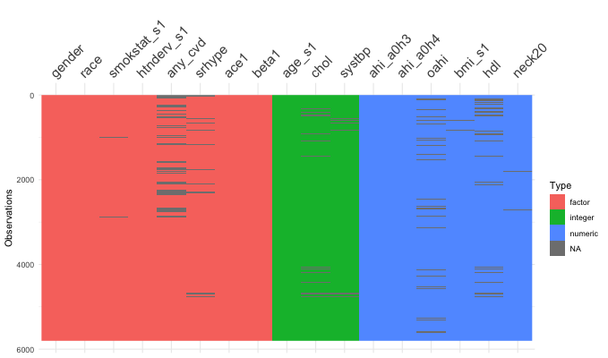

In this R notebook, we're going to learn the basics of predictive modeling. 

## Before you start

Save this notebook under a different name in your `shhs_workshop` folder. That way, you have a backup just in case. 

## What is an R Notebook?

An R Notebook is a way to run R code and save the output (such as graphs and tables) in the same document. Make sure that you have opened the project file (`shhs_workshop.rproj`) in RStudio before you do anything. This will set you up so R knows where the data is.

There are two main formats for a R Notebook. The first are known as the *markdown chunks*, which are mostly text, and let you add commentary about your findings. The other format is the *code chunk*, which is started by the three backticks (\`\`\`) and a `{r}`, such as the code block below. Usually, we want the code block to give us an output, such as a table or a graph. However, the code isn't run until we hit the play button. This is really important to know. 

R Notebooks are presented two ways: as an editable document (which is what you have here), and a preview document. You will be able to see the preview document by hitting the `Preview` button. Try hitting the "Preview" button now.

## Important!

Be sure to go slowly through the notebook slowly and read the code. If you just press play without reading and understanding the code, you will miss out on the learning! Talk about the code blocks with your group partner.

## Getting Help

If you're confused about a function, such as `head`, you can run `?head` (adding a question mark to the beginning of the function) to get help about that function. Try running the command below by hitting the play button on the top right of the code chunk. The help window for the function should open on the right.

```{r}
?head
```

## First Things First

The first thing to do is to load the data into your workspace. Click the `play` button on the below code chunk. We first load in some packages: `broom`, `tidyr`, `dplyr`, and `visdat`. Then we're going to load our data using the `read_rds` function. We use the `<-` to *assign* our data into the `shhs_data` object. 
If you want to learn more about loading data from different formats, you can check out this DataCamp article: https://www.datacamp.com/community/tutorials/r-data-import-tutorial

```{r setup}
library(broom)
library(tidyr)
library(dplyr)
library(visdat)
library(caret)

shhs_data <- readRDS("data/common_data_small.rds")
```

Look at your `environment` tab and click on the `shhs_data` line. You will be able to see a spreadsheet like view of the data.

## Show the first few rows of the data

Let's look at the first few rows of the data with the `head()` command. The head command will show the first few rows.

```{r}
head(shhs_data)
```

## Including an image from our Data Explorer

You can add an image by using what's called a markdown tag into this document. For example, if I wanted to add the image in our `images` folder called `sample_image.png`, you use this little bit of code:



Unfortunately, the image doesn't pop-up when we're editing the notebook, but it will when we hit the "Preview" button on the notebook bar above. Try it out!

## Data Wrangling 101: Select our covariates

Ok, now we're going to build a simple predictive model with our covariates. We're going to use the `select` function in the `dplyr` package to pick our variables from the larger dataset. This is important to do beforehand because we're going to select the complete cases in our data to model (see below).

This will seem weird at first, but the `%>%` is what's called a `pipe` and lets us flow our data from one function to another. 

Think about it: which variables are we selecting? What is our outcome we're trying to predict?

```{r}
shhs_data_model <- shhs_data %>% select(any_cvd, age_s1, gender, bmi_s1)

head(shhs_data_model)
```

We're going to use `visdat` to summarize our data again. What do you notice in our dataset?

```{r}
visdat::vis_dat(shhs_data_model)
```

## What are you going to do about `NA`s?

Ugh. There are NAs in our data! We're going to use the `drop_na` function to remove all rows that are not complete. 

```{r}
shhs_data_model_filtered <- shhs_data_model %>% tidyr::drop_na()

visdat::vis_dat(shhs_data_model_filtered)
```

## Separating out our data

Ok, now we have to separate our data into two sets: the *training* set and the *test* set.

1. Training set: a set of data with which we build (or train) our model with. 
2. Test set: a set of data with which we test the predictive power of our model.

How do we relate the test/train set to internal validity? Why is it important to hold out some data for testing?

```{r}
shhs_train_index <- createDataPartition(shhs_data_model_filtered$any_cvd, p=0.85, list=FALSE)
shhs_train_data <- shhs_data_model_filtered[shhs_train_index,]
shhs_test_data <- shhs_data_model_filtered[-shhs_train_index,]

```

```{r}
nrow(shhs_train_data)
```

```{r}
nrow(shhs_test_data)
```

## A Basic Model

Here we're going to build a basic model with `any_cvd` as our outcome (what we want to predict), and `shhs_train_data` as our data. 

Take a look at how we build the model below. The first thing we need to specify is our *forumla*. One of the most confusing things about R is the formula interface. The thing to remember is that formulas have a certain form. If `Y` is our dependent variable and `X1`, `X2` are independent variables, then the formula to predict `Y` has the format `Y ~ X1 + X2`. Usually these variables come from a data.frame, which is supplied by the `data` argument to the function. Note that we don't need quotes to refer to the variables in the `data.frame`.

```{r}
basic_model <- glm(#put your formula below
                   formula = any_cvd ~ gender + age_s1 + bmi_s1, 
                   # binomial
                   family = "binomial", 
                   #we put our data into the data argument
                   data =    shhs_train_data
                   )
```

Show the coefficients of the model with the `tidy` function from `broom`. Each row of this is a predictor in our model, and we focus on two columns. 

## Predictive model

The important thing to understand with logistic regression is that it actually calculates a probability, which is the likelihood that you are likely to have cardiovascular disease in the next 10 years. A probablility of 0.9 means that you are more likely to have CVD, and a probability of 0.1 means that you are less likely to have CVD.

Let's plug in a couple of patients into our model. 

1. `patient1` is going to be older `65`, `Male`, and have a high BMI (`44`). Is this patient more likely to have cardiovascular disease or not?
2. `patient2` is going to be younger `25`, `Female` and have a low BMI (`23`). Is this patient more likely to have cardiovascular disease or not?
3. `patient3` is a middle aged (`42`), `Female` patient with a middling BMI (`31`)? Is she more likely to have cardiovascular disease or not?
4. `patient41` is a middle aged (`40`), female patient, with a higher BMI (`41`). What do you think?

Let's plug in these four patients into our model. First we specify our data. We have to specify each variable separately and then glue them together as a `data.frame`.

```{r}
pat_name <- c("patient1", "patient2", "patient3", "patient4")
gender <- factor(c("Male", "Female", "Female", "Female"))
age_s1 <- c(65, 25, 42, 60)
bmi_s1 <- c(44, 23, 31, 41)

patient_table <- data.frame(pat_name, gender, age_s1, bmi_s1)
patient_table
```

We can pass `patient_table` into our model with the `augment` function and it will evaluate our patients. When we look at this table, we can see that the `.fitted` column contains our predicted probabilities.

```{r}
pat_table_aug <- augment(basic_model, newdata=patient_table, type.predict = "response")
pat_table_aug
```

Let's plot the predicted probability for each patient.

```{r}
pat_table_aug %>% ggplot(aes(x=pat_name, y=.fitted, fill=pat_name)) + 
  geom_bar(stat="identity") + ggtitle("Predicted probability for each patient")
```

One thing to note: even though we thought patient 1 had a high probability of CVD, they are only predicted to have a 40% probability of having CVD. This suggests that our model is not completely predicting with 100% certainty.

Also, patient 3, which we thought might be on the cusp of the predicted probability, actually has a low predicted probability! What about patient 4?

The predictor variables aren't all equally important in the model. They're actually weighted in terms of importance. We can see this if we use `tidy` on `basic_model`.

```{r}
tidy(basic_model)
```

The coefficients of our model specify the weights, or importance of our variables in calculating the predicted probablity. Another thing to note is the `p.value` associated with each variable in our model. For an alpha cutoff of 0.05, all three variables are highly significant predictors in the model.

## Evaluating using our test set

What if we plug in our test set into the model? How are the predicted probabilities distributed?

```{r}
predictions <- augment(basic_model, newdata = shhs_test_data, type.predict = "response")
predictions
predictions %>% ggplot(aes(x=.fitted)) + geom_histogram()
```

We see that the majority of our test patients have a lower predicted probability. Naively, let's choose that if our patient has a predicted probability > 0.5, that they are a cardiovascular risk and if they are less than or equal to 0.5, they are not a cardiovascular risk. Let's recode a new variable, `predict_cvd`, with this variable

```{r}
cutoff <- 0.5

predictions2 <- predictions %>% mutate(predict_cvd = case_when(.fitted > cutoff ~ "Yes", 
                                               .fitted <= cutoff ~ "No"))

predictions2
```

Now we have a set of predictions and we can compare them to the true value `any_cvd` in our dataset. 

```{r}
conf_matrix <- predictions2 %>% select(any_cvd, predict_cvd) %>% table()
conf_matrix
```

Try adjusting the `cutoff` above and see how the different cells of the table change.

## Accuracy versus balanced accuracy

Try adjusting `cutoff` below and look at what happens to Accuracy versus Balanced accuracy.

```{r}
cutoff <- 0.4

predictions2 <- predictions %>% mutate(predict_cvd = case_when(.fitted > cutoff ~ "Yes", 
                                               .fitted <= cutoff ~ "No"))

conf_matrix <- predictions2 %>% select(any_cvd, predict_cvd) %>% table()

caret::confusionMatrix(data = conf_matrix, positive="Yes")
```
```{r}
tidy(basic_model)
```


## A New Model:

We suspect that `neck20` (neck circumfrence) might be a better predictor than `bmi_s1`. We know that `bmi_s1` is correlated with `neck20` (Check it using the app!) and that neck circumfrence may be a better predicter or airway obstruction (and therefore apnea). Given our knowledge of the biology, could `neck20` be a better predictor?

Do some detective work about `neck20`. How is it measured? 

```{r}
#remember to subset the proper variables!
shhs_data_filtered2 <- shhs_data %>% select(#fill in with the variables! 
  ) %>% 
#use drop_na() for now  
  drop_na()

#separate into test/train sets
shhs_train_data2 <- shhs_data_filtered2[shhs_train_index,]
shhs_train_data2 <- shhs_data_filtered2[-shhs_train_index,]

basic_model2 <- glm(any_cvd ~  ,#fill your covariates here
                    family = "binomial", 
                    #we put our data into the data argument
                    data =    shhs_train_data2
)

#evaluate basic_model2 here
```

## Comparing models

We're going to use AIC (Aikake Information Criterion) to evaluate our new model compared to the old. AIC is a measure of model complexity combined with predictive power. We want our model to be as simple as possible without sacrificing predictive power. This criteria is known as *parsimony*.  A lower AIC means that our model is both simpler and more predictive. So let's compare the two models with AIC using the `glance` function.

```{r}
glance(basic_model)
```

```{r}
glance(basic_model2)
```

Which of the models has the lower AIC? Which should we choose?

## Summary

We learned a lot today in this notebook! Specifically,

1. How to select our variables using `select()`
2. How to only use complete cases using `drop_na()`
3. How to separate our data into test/train sets
4. How to build our model using `glm()`
5. Testing the predictive power of our model using patients
5. Ways to evaluate the predictive power of our model

There's a lot of info in this notebook. Take a look at it and bring your questions for the next session!