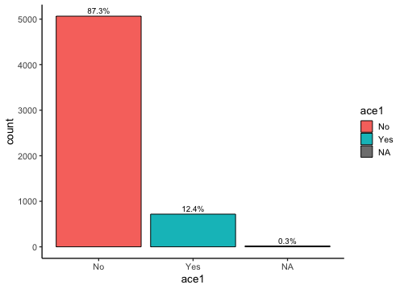

```{r setup, include=FALSE}
library(broom)
library(tidyr)
library(dplyr)
library(visdat)
library(caret)

shhs_data <- readRDS("data/common_data_small.rds")
```

In this notebook, you will compile your following report. For each step, show one figure that justifies your inclusion or exclusion of variables. 

Remember, you can save your figures to the `images` folder and include them using the following syntax:



Each group should submit the HTML preview to laderast@ohsu.edu (it will be called `final_report.nb.html`) with your group name (rename the file `final_report_groupx.nb.html`. Make sure to fill out the `author` field above with everyone's name!

Don't worry about removing variables from the model at each step. We're only adding variables to the model. Also, you don't have to show the performance of the model after each step, only show the performance of the final model.

## Step 1: Initial Model

*Choose your initial model from the following. You don't need to show any figures here.*

- `any_cvd` (your outcome)

- `age_s1`
- `gender`
- `bmi_s1`
- `neck20`

```{r}
#show your code for the basic model here
```

## Step 2: Do you add `race` to your model?

*Put a short definition of `race` from your model. If you think it is important to add race and you are satisfied with the quality in the dataset, show a figure here. If you don't think it's important or you aren't satisfied with the quality of the `race` variable, show a figure here.*

```{r}
#put model code here
```

## Step 3: Do you add `hypertension` to your model?

*Investigate adding one of these variables to your model. If you think the variable is important, show one figure for including it. Talk about your choice of variable, how it is measured/calculated, and its impact on your model.*

- `htnderv_s1`
- `srhype`
- `systbp`

```{r}
#put model code here
```

## Step 4: Apnea Hypopnea Index

*Investigate adding one of these variables to your model. If you think the variable is important, show one figure for including it. Talk about your choice of variable, how it is measured/calculated, and its impact on your model.*

- `ahi_a0h3`
- `ahi_a0h4`

```{r}
#put model code here
```


## Step 5: Evaluation of Final Model

*Assess the impact of selecting complete cases for your covariate. If you like, you can show a before/after `vis_dat` for your set of variables (before dropping NAs and after dropping NAs). At the very least, show the number of rows before and after.*

```{r}

```

*For your test set, calculate your predicted probabilities and plot them as a histogram.  Choose a threshold based on your priorities (do you want reduced false positives/false negatives?), and assess the accuracy/balanced accuracy of your thresholded model.*

```{r}

```

*Were the sleep covariates (`neck20`, `ahi_a0h3`, and `ahi_a0h4`) useful in predicting `any_cvd`? Talk about why or why not.*

*Given your final results, how would you recommend the model be used?* 
